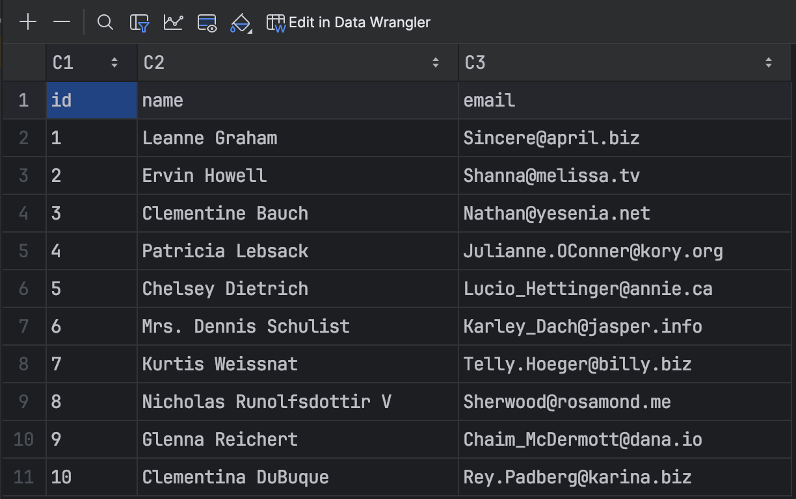

# Automatization and Integration with external api

This project is a Python script that fetches user data from a public API, 
saves it to a CSV file, and runs automatically using Celery with Redis as the message broker. 
The entire setup is containerized with Docker.

## Project Structure
* main.py: The main Python script containing the logic to fetching data from the API and write it to a CSV file.

* tasks.py: A dedicated script to define and run the Celery worker with task to execute python script from main.py.

* requirements.txt: Lists all necessary Python dependencies, such as requests, celery, and redis.

* docker-compose.yml: Defines the Docker services for the Redis broker, the Celery worker, and a service to run the Python script.

## Prerequisites
You need to have Docker and Docker Compose installed on your system.

## Setup and Installation
### Clone this repository to your local machine:
```
git clone https://github.com/AndreiVed/integration-with-external-api.git
cd integration-with-external-api
```

### Build the Docker images for the services defined in docker-compose.yml:
```
docker-compose build
```

### Usage
Start all the services defined in the Docker Compose file. This will spin up the Redis broker and the Celery worker in the background.

```
docker-compose up -d
```

The Celery task is configured to run periodically. The worker will automatically execute the task to fetch user data and save it.

The output file, ```users.csv```, will be created in the root directory of the project.

To stop and remove the containers, networks, and volumes, use:

docker-compose down

### Example Output
After the task runs, the ```users.csv``` file will be created with the following format:


